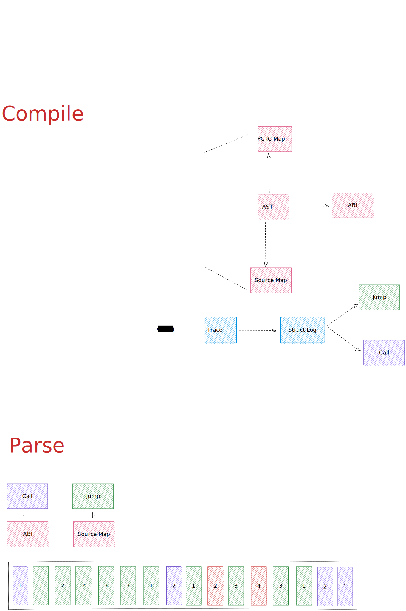

# Solidity CFG

A demo for ast analysis of solidity's cfg. Traditional cfg analysis is based on opcode, which is difficult to understand.   

In this demo, ast analysis is added to the basic analysis of opcode, so as to understand the call relationship between functions and intermediate variable data in a more readable way.    

## How

## Todo

- [ ] Support contract call abi parsing
- [ ] Support user-defined type ast parsing